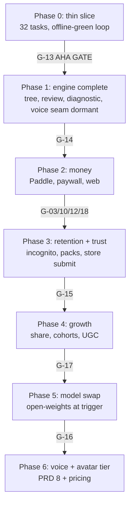
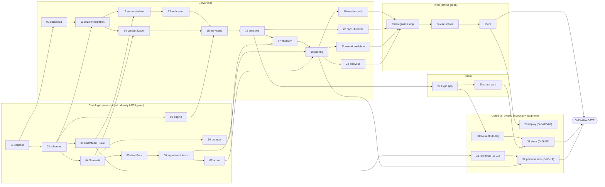

# Build plan map (charisma communication app)

One-page map of BUILD-EXECUTION-PLAN.md. AUTONOMOUS = agents build offline against the mock
boundary (no accounts). GATED (G-xx) = needs a human to supply an account, secret, or
judgment first. No em-dashes.

## Phase overview

| Phase | Goal | Tasks | Exit gate |
|---|---|---|---|
| **0. Thin vertical slice** | Empty repo to a green, offline, self-verifying challenge loop (the Sam housewarming unit) | P0-01..P0-32 | **G-13 the aha gate** |
| **1. Engine complete** | Full 8-skill tree, router, spaced review, disguised diagnostic, + dormant voice seam | P1-01..P1-07 | G-14 persona quality |
| **2. Money** | Paddle MoR, webhook->entitlement, paywall, web page | P2-01..P2-04 | G-03/10/12/18 |
| **3. Retention + trust** | Incognito, character packs, streak freeze, store submission | P3-01..P3-05 | G-15 store approval |
| **4. Growth** | Share card, cohort SQL, content tooling, UGC brief | P4-01..P4-04 | G-17 (D7>=20%, paid>=2%) |
| **5. Model swap** | Open-weights ChatModel, eval harness, 5% canary | P5-01..P5-03 | G-16 trigger + blind judge |
| **6. Voice + avatar tier** | Enable voice seam, avatar premium tier (PRD 8, AVATAR-TIER-PRICING.md) | (deferred) | its own gates |

Addendum A (competitive-research requirements A1-A5) slots into Phases 1-3 and 6, see bottom.

## The whole thing, phase flow

## Phase 0 dependency map (the part buildable NOW, no accounts)

The chain P0-01..P0-25 is entirely AUTONOMOUS: it takes an empty repo to a green offline loop.
P0-26..P0-32 are the gated tail (need real accounts) and the aha gate.

## Human-gate map (what a human must supply, and when)

| When it bites | Gates | What the human provides |
|---|---|---|
| End of Phase 0 (to go live/tune) | G-01 Anthropic key, G-13 aha judgment, G-14 persona taste | API key + the go/no-go call |
| Deploy Phase 0 | G-04 Hetzner VPS, G-05 domain+DNS, G-09 GitHub secrets, G-02 Clerk | accounts + secrets |
| Store | G-06 Apple Dev, G-07 Play Console, G-11 trademark, G-19/20 assets | store accounts + listing |
| Money (Phase 2) | G-03 Paddle, G-10 Korean SME entity + bank, G-12 TOS, G-18 revenue-on | entity + billing + legal |
| Growth/scale | G-15 store call, G-17 growth go/no-go, G-16 model-swap, G-21 UGC | judgment calls |

Everything else builds against Fakes (FakeChatModel, FakeAuth, FakeBilling, Noop error/receipt)
until a gate clears. Agents never invent a credential or fake past a gate.

## Where the research-driven requirements land (Addendum A)

- **A1 trust billing UX** (visible cancel, pre-charge reminder, card-later) -> Phase 2, with A1 acceptance.
- **A2 coach memory** (feedback references prior weak points) -> Phase 1 engine.
- **A3 real-world transformation events** (`real_world_report`, `situation_outcome`) -> Phase 1, surfaced Phase 3.
- **A4 outcome-tied scenarios** (onboarding target situation, event-tagged units) -> Phase 1 content.
- **A5 voice/avatar reliability P0** -> Phase 6, launch-blocking.

## Status now
Phase 0 core (P0-03..P0-08 logic) is already written and **63/63 test-green + typecheck clean**.
The rest of Phase 0 (scaffold, server, client, proof) is unbuilt and buildable by autonomous
agents against the mock boundary, no accounts needed, up to the G-13 aha gate.
