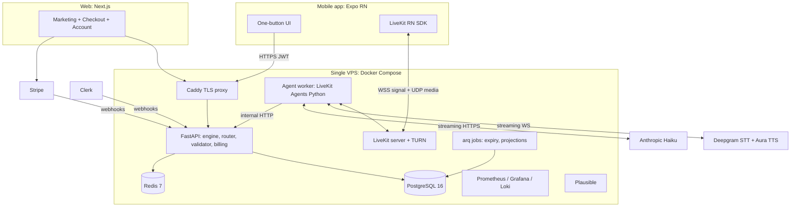
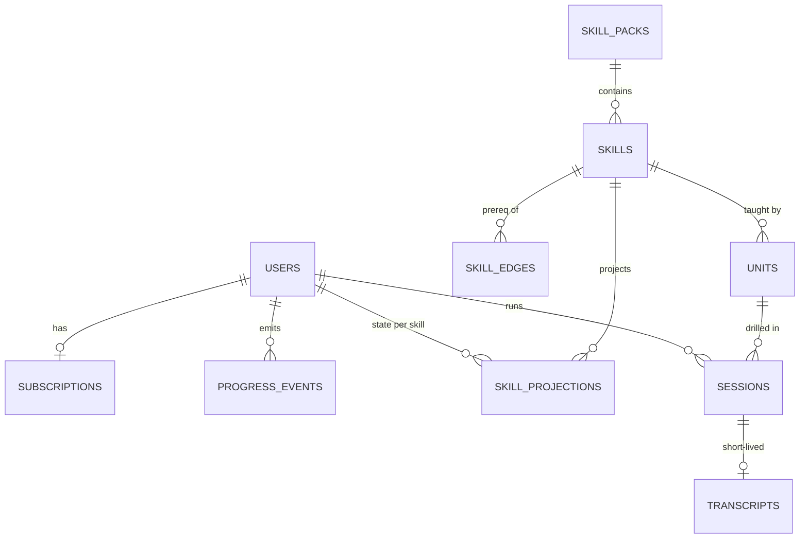

# CADENCE: Voice-First Communication Coaching
## Complete PRD, Architecture, and Build Plan

Working title "Cadence" (placeholder, rename freely). Prepared as a build-ready specification for a competent solo developer. Every decision is made; where a call was ambiguous, the reasoning is stated inline in one or two lines.

---

## 0. Decision Summary (the whole stack on one page)

| Layer | Decision | Why (one line) |
|---|---|---|
| Mobile framework | **React Native + Expo (dev client, not Expo Go)** | Clerk has a first-class Expo SDK and LiveKit has a mature React Native SDK; Flutter has neither officially |
| Voice transport | **WebRTC via self-hosted LiveKit server** | Battle-tested SFU with built-in TURN, echo cancellation, mobile SDKs; running raw WebSocket audio yourself is months of edge cases |
| Voice orchestration | **LiveKit Agents (Python) worker** with official Deepgram STT, Deepgram Aura TTS, and Anthropic plugins | The exact STT-LLM-TTS turn pipeline (interruption handling, endpointing, sentence-chunked TTS) already exists as a framework; you write the persona and scoring logic, not the plumbing |
| Backend API | **Python 3.12 + FastAPI + SQLAlchemy 2 + Alembic** | One language across API and agent worker; the deterministic validator and engine are shared code, not an RPC boundary |
| Database | **PostgreSQL 16** (single instance, same VPS) | Event log, projections, content, and subscriptions in one boring, durable store; JSONB carries unit/rubric payloads |
| Ephemeral state | **Redis 7** | Live session state, incognito daily counters (TTL keys), rate limits; nothing here is ever durable |
| Auth | **Clerk** (pinned) | Shared across Expo app and web; backend verifies Clerk JWTs statelessly |
| Payments | **Stripe Checkout + Billing + Customer Portal on the web only** (pinned) | Login-only mobile app under Apple's reader/multiplatform rule keeps ~97% of revenue |
| STT / TTS | **Deepgram Nova streaming STT + Aura streaming TTS** (pinned) | |
| Reasoning | **Claude Haiku (claude-haiku-4-5)** with prompt caching (pinned) | |
| Web | **Next.js (self-hosted in Docker)**, one marketing page + checkout + account | Clerk and Stripe integrations are first-class; self-hosts fine as a plain Node process |
| Reverse proxy / TLS | **Caddy** | Automatic Let's Encrypt with a 10-line config; fronts API, web, and LiveKit signaling |
| Deployment | **Docker Compose on one Hetzner VPS** (CPX41-class to start), GitHub Actions builds images, `compose pull && up -d` deploy | A solo dev needs one machine and one file, not Kubernetes |
| Backups | **Nightly pg_dump + restic to an S3-compatible offsite bucket** | Offsite object storage is a dumb byte sink, not a managed platform; the constraint is about compute/PaaS |
| Observability | **Grafana + Prometheus + Loki (Docker), Sentry SDK (self-hosted Sentry optional later)** | Latency percentiles on the voice loop are a launch requirement, not a nice-to-have |
| Analytics | **Self-hosted Plausible** | Content-free, cookie-less, retention/conversion only |

Hard product pins honored throughout: self-hosted VPS only, Clerk auth, Deepgram STT/TTS, Claude Haiku, Stripe on web, no Apple IAP, no ElevenLabs.

---

# 1. PRD

## 1.1 Product overview

Cadence is a paid, voice-first mobile app that makes you a measurably better communicator through one daily live voice roleplay. The interface is one screen with one big Call button. Tap it, and within about two seconds you are in a spoken conversation with an AI partner playing a specific, resistant, realistic role. Hang up, and you get exactly three things: one thing you did well, one thing to fix, and a progress ring that ticks.

There is no library, no course catalog, no browsing, no lesson list. A mastery-learning engine (modeled on Alpha School's enforced-mastery approach) decides the single next drill from your state. You cannot skip, you cannot jump ahead, and due reviews are served before anything new. The engine is enforced structure: the app's opinion of what you should practice today is the only thing on the menu.

One brand promise: become a better communicator. Three modes under it, all live at launch.

## 1.2 Target users

- **Sales professionals and founders** (SALES mode): SDRs, AEs, founders doing their own sales, anyone who needs reps against a resistant prospect without burning real pipeline.
- **Professionals who present** (PUBLIC SPEAKING mode): people with recurring meetings, pitches, talks, wedding toasts, interviews; people who rehearse alone in the mirror today.
- **People who want to connect better** (EVERYDAY mode): people who find small talk draining or one-sided, want to ask better questions, and want strangers to enjoy talking to them.

Common profile: adult, English-speaking at launch, owns a smartphone, willing to pay $12/month for daily deliberate practice, motivated by visible progress. Not targeted at launch: children, clinical speech therapy, non-English, enterprise team accounts.

## 1.3 The three modes

| | SALES | PUBLIC SPEAKING | EVERYDAY |
|---|---|---|---|
| AI partner plays | A resistant prospect (skeptical, busy, withholds pain unless earned) | An audience/scenario host (introduces a scenario, listens, reacts, asks follow-ups) | A new acquaintance who warms up only when shown genuine interest |
| Skills trained | Discovery, open questions, objection handling, closing, persuasion structure | Delivery, pacing, filler control, storytelling structure, presence, Q&A | Question quality, listening, reciprocity, callbacks, making others feel interesting |
| Canon sources | Public sales methodology: SPIN questioning, Sandler-style pain funnels, classic objection-handling patterns (public descriptions, not course text) | Classical rhetoric, Toastmasters-style public drill formats, storytelling structure (hook/struggle/resolution), public delivery research | Conversation and connection research: active listening, follow-up questions, self-disclosure reciprocity (e.g., published findings on question-asking and likability) |
| Partner's win condition | User earns information and commitment through technique, not pitching harder | User delivers within structure and constraint | Partner "warms up" only if the user reciprocates and follows up genuinely |

All three run on the same engine, same session pipeline, same scoring architecture. A mode is just a different skill pack (Section 6).

## 1.4 Core flows

### Flow A: Onboarding (first launch, target under 3 minutes to first call)
1. Splash → Clerk sign-in (email code or Apple/Google SSO). No account creation marketing inside the app; the app assumes you subscribed on the web. If the signed-in account has no active subscription, show a neutral "No active subscription for this account" screen with no purchase link and no pricing (App Store compliance, Section 10.5).
2. Mode picker: three large cards (SALES / SPEAKING / EVERYDAY). Copy is one line each. The user picks a **primary mode**; the other two remain one swipe away. This is one of the three "perfect surfaces."
3. Mic permission request with one honest sentence: "Calls are live audio. We never store your voice."
4. Straight into the diagnostic call (Flow B). No tour, no feature carousel.

### Flow B: Diagnostic
- One 4-5 minute call per mode, taken the first time the user enters that mode.
- The AI partner runs a compressed scenario that touches 3-4 anchor skills of that mode's tree (e.g., SALES: opens with "you have 5 minutes, what's this about?" and later volunteers one objection).
- Scored with the same rubric machinery as normal drills, but against **placement thresholds**: the engine marks anchor skills as provisionally-passed or not, then places the user at the deepest node whose prerequisites all provisionally passed.
- Result card says: "You're starting at: [skill name]" plus one strength, one fix. The user never sees the tree.
- Placement is conservative: any ambiguity places lower. Extra reps at an easy level cost minutes; a hole in the foundation costs the product's credibility.

### Flow C: The practice-call loop (the core loop, daily)
1. Home screen: mode name at top, one big Call button, progress ring around it, streak count under it. Nothing else. If a spaced review is due, the button subtitle says "Review: [skill]"; otherwise "[unit title]".
2. Tap Call → app requests a session from the API → API resolves the user's single next unit (gating router, Section 5.3) → API mints a LiveKit token and dispatches the agent with the unit's persona brief → app joins the room. Target: audio flowing in under 2.5 seconds from tap.
3. A one-sentence spoken brief from the partner sets the scene ("You booked 15 minutes with me and I'm already annoyed about it. Go."). No reading, no text setup screen. A small text chip shows the drill's one-line goal during the call for glanceability.
4. Live conversation, 3 to 10 minutes depending on the unit. Barge-in supported (user can interrupt the AI mid-sentence). A timer ring depletes; at the unit's max time the partner wraps up naturally.
5. Hang up (user taps End, or timer ends, or the scenario reaches its natural close).
6. Scoring runs (2-6 seconds): Haiku labels and judges the attempt; the backend validator recomputes and rules (Section 7). A subtle "scoring" shimmer plays; never a spinner with copy like "AI is thinking."

### Flow D: Result card (the second perfect surface)
Exactly three elements, in this order:
1. **One thing you did well**, with a short verbatim quote of the user from the transcript as evidence.
2. **One thing to fix**, phrased as the next rep's instruction ("Next call: ask two follow-ups before you share your own story"), also anchored to a quote or a number ("you talked 71% of the time").
3. **The ring ticks** (animated): progress within the current skill's mastery counter (e.g., 1 of 2 passes), or the skill seals shut with a small lock-opening animation when mastered and the next skill's name is revealed.
Below the fold (one swipe): the numbers (talk ratio, open questions, fillers/min, longest monologue) and the expiring transcript with a Save toggle. Nothing else. No share buttons at launch.

### Flow E: Progress
- The ring on the home screen is the primary progress artifact: it represents mastery progress through the current skill.
- A single Progress screen (tap the ring): current skill name, skills mastered count per mode, streak, reviews due, and a simple 30-day activity strip. Explicit non-goal: no public leaderboards, no social graph, no badges wall.

### Flow F: Incognito (product feature, one tap)
- A ghost icon on the home screen toggles incognito for the next call. In incognito: the session runs entirely in memory (Redis + process memory), no transcript row is written, no progress event is appended, no streak credit, and the result card is shown once and is unrecoverable after dismissal.
- The only trace is a content-free Redis counter `incog:{user_id}:{yyyymmdd}` with a 24h TTL, used solely to enforce the daily session cap (incognito calls count against the same cap; they cannot become a free unlimited lane).
- Copy in the toggle sheet is honest: "Retained nowhere on our side. Audio and words still pass through our speech and AI providers momentarily to run the call; we use their zero-retention settings."

### Flow G: Subscription (web only)
1. Marketing page (one page): promise, 30-second demo video of a call plus result card, pricing ($12/month or $120/year, "2 months free"), 30-day money-back guarantee, FAQ, Get Started.
2. Get Started → Clerk sign-up → Stripe Checkout (hosted) → success page: "Download the app and log in with this account" with store badges and a QR code.
3. Manage/cancel/refund via Stripe Customer Portal linked from the web account page. The 30-day money-back guarantee is honored by a one-click "Request refund" that opens a prefilled email (manual at launch; automate later).
4. Entitlement: Stripe webhooks maintain a `subscriptions` row; the API checks entitlement on session start. Grace: `past_due` keeps access 7 days.

## 1.5 The one-button UX in detail

- **Home = mode name + Call button + ring + streak.** The Call button is 40% of screen height, thumb-centered. Long-press does nothing (no hidden menus). The three surfaces to perfect: mode selector, in-call screen, result card. Everything else (settings, legal, delete, incognito sheet, progress) hides behind a single top-right avatar menu and the ring tap.
- **In-call screen:** partner name and role at top ("Dana, Head of Ops"), a live waveform, the one-line goal chip, elapsed/max time ring, End button. No live transcript on screen (it pulls the eyes down and kills conversational behavior).
- **No browsing anywhere.** The user can switch mode (three cards) but within a mode there is exactly one next thing, always.
- Sound design matters: distinct connect chime, a soft "scoring" texture, a satisfying tick when the ring advances. These three sounds are the app's tactile identity.

## 1.6 Session cap and fairness

- **Cap: 3 scored sessions per day per user** (across modes, incognito included), plus unlimited-feeling but actually capped total of **30 voice-minutes per day**. Both enforced server-side at session start; the app shows "Back tomorrow" state after the cap with the streak preserved.
- Rationale: pedagogy (mastery learning wants spaced daily reps, not binging) aligns perfectly with the cost budget (Section 11). Sell the cap as the method, because it genuinely is.

## 1.7 Explicit non-goals (v1)

- No free tier, no trials (money-back guarantee instead). No Apple/Google IAP.
- No human coaching marketplace, no team/enterprise features, no admin dashboards for orgs.
- No lesson browsing, course library, or user-selected drills. Ever, on principle.
- No social features, sharing, or leaderboards.
- No languages other than English. No web-based calling client (mobile only for practice; web is marketing + billing).
- No video, no avatar faces. Voice only.
- No long-term audio storage of any kind, including opt-in.
- No offline mode.

---

# 2. Tech Stack (every choice, one-line rationale)

## Client
- **React Native 0.7x + Expo SDK (custom dev client / EAS-style local builds, not Expo Go):** Clerk ships an official Expo SDK and LiveKit ships `@livekit/react-native`; both are required and both are first-class here.
- **TypeScript everywhere on the client:** the app is small; type-safe API client generated from the FastAPI OpenAPI schema (`openapi-typescript`).
- **State:** Zustand (tiny, no boilerplate) + TanStack Query for server state.
- **Navigation:** Expo Router (three routes total: home, call, result; plus modals).
- **Audio session config:** `@livekit/react-native` + `expo-av` audio mode for speakerphone/earpiece toggle, CallKit-style audio session on iOS via LiveKit's audio session APIs.
- **Build note:** native builds run locally via Xcode/Gradle or on a CI mac runner; EAS cloud build is a convenience, not a dependency (self-hosting constraint applies to serving users, not to compiling binaries, but staying independent of it keeps you honest).

## Web
- **Next.js (App Router) self-hosted as a Node process in Docker:** one marketing page, `/account`, Clerk components, Stripe Checkout redirect, Stripe webhook route lives in FastAPI (single source of billing truth), not in Next.
- **Tailwind CSS:** one page, ship fast, keep it crisp.

## Backend
- **Python 3.12, FastAPI, Pydantic v2:** async-first, OpenAPI for free, same language as the agent worker so the engine and validator are one shared package (`cadence_core`).
- **SQLAlchemy 2 (async) + Alembic:** migrations from day one because the event log must never be hand-edited.
- **LiveKit Agents (Python) worker:** implements the voice pipeline with official plugins: `livekit-plugins-deepgram` (STT + Aura TTS) and `livekit-plugins-anthropic` (Haiku). Turn detection, interruption handling, and sentence-chunked TTS streaming are framework features.
- **Redis 7:** live session records, incognito counters, per-user daily caps, webhook idempotency keys, rate limiting (all TTL'd; Redis is never a source of durable truth).
- **Job runner: `arq` (Redis-based) worker** for transcript expiry sweeps, projection rebuilds, and Stripe reconciliation. Chosen over Celery for being tiny and async-native.

## Fixed external services (pinned)
- **Deepgram:** Nova streaming STT (interim results + endpointing) and Aura streaming TTS over WebSocket. Zero-retention/opt-out flags enabled on the account (Section 8).
- **Anthropic claude-haiku-4-5:** partner roleplay (streaming) and end-of-call judge (JSON output). Prompt caching on the static system/persona blocks cuts input cost roughly 90% on cache hits; this is the single most important cost lever (Section 11).
- **Clerk:** Expo SDK on mobile, Next.js SDK on web, JWT verification via JWKS in FastAPI middleware. Clerk webhook (`user.deleted`) triggers hard delete.
- **Stripe:** Checkout, Billing, Customer Portal, webhooks (`checkout.session.completed`, `customer.subscription.updated|deleted`, `invoice.payment_failed`).

## Infrastructure (all on the VPS)
- **Host: 1x Hetzner dedicated-vCPU VPS (CCX23/CPX41 class: 8 vCPU, 16-32 GB) to start**, Ubuntu 24.04 LTS. Scale path: move Postgres to a second VPS, then add a second LiveKit/agent node (Section 9.5).
- **Docker Compose** as the only orchestrator. One `compose.yml`, profiles for `app`, `voice`, `observability`.
- **Caddy** reverse proxy: TLS for `cadence.app` (web), `api.cadence.app` (FastAPI), `lk.cadence.app` (LiveKit signaling WSS). LiveKit media uses UDP 50000-60000 plus TURN/TLS 5349 fallback for hostile networks.
- **LiveKit server (single node) + embedded TURN**, config in `livekit.yaml`, Redis-backed.
- **Observability:** Prometheus + Grafana + Loki + Promtail containers; FastAPI and agent expose `/metrics`; the four dashboards that matter: voice-loop latency percentiles, session success rate, Deepgram/Anthropic spend per session, cap-hit rate.
- **Plausible (self-hosted)** for the marketing site + a handful of content-free app events proxied through the API (`session_started`, `session_completed`, `subscribed`, `churn`).
- **Backups:** nightly `pg_dump` piped to restic → offsite S3-compatible bucket (Backblaze B2 or Cloudflare R2; dumb byte storage, not compute). Weekly restore test scripted.
- **Secrets:** SOPS + age encrypted `.env` files in the repo; decrypted on deploy.
- **CI/CD:** GitHub Actions: test → build images → push GHCR → SSH deploy step runs `docker compose pull && docker compose up -d` with health checks and automatic rollback to previous tag on failed health.

---

# 3. Architecture

## 3.1 System overview



Everything inside the VPS box is yours. The only egress is Deepgram, Anthropic, Clerk JWKS/webhooks, and Stripe.

## 3.2 The real-time voice pipeline (the call path)

Session start sequence:
1. App `POST /v1/sessions` with Clerk JWT and `{mode, incognito}`.
2. API checks entitlement (subscription row) and caps (Redis counters). Rejections are instant and human ("You're at today's 3 calls. Same time tomorrow.").
3. Gating router (Section 5.3) resolves the single next unit. API writes a `sessions` row (skipped entirely for incognito; Redis-only record instead), builds the **agent job payload**: unit id, persona brief, resistance brief, rubric signal list, max duration, incognito flag.
4. API creates a LiveKit room `sess_{id}`, mints two tokens (user, agent), dispatches the agent (LiveKit agent dispatch API), returns `{room, token, unit_goal_line, max_seconds}` to the app.
5. App joins; agent joins; agent speaks the one-line scene brief. Clock starts.

In-call turn loop (all inside the agent worker):
```
user audio (WebRTC/Opus) → LiveKit → agent
  → Deepgram Nova streaming (interim + final transcripts, endpointing ~300ms silence)
  → turn detector decides "user finished"
  → Haiku streaming completion (persona system prompt CACHED + rolling turn history)
  → first sentence chunk → Deepgram Aura streaming TTS → audio frames → LiveKit → user
```
- **Interruption (barge-in):** when Deepgram emits speech during agent playback, the agent cancels TTS playback and the in-flight Haiku stream, truncates the assistant turn at the spoken word boundary, and yields the floor. This is native LiveKit Agents behavior; keep it on.
- **Latency budget (voice-to-voice, p50 target ≈ 1.3s, p95 ≤ 2.5s):** endpointing 300ms + Haiku TTFT ~350ms + Aura TTFB ~250ms + network/jitter ~200-400ms. "Slightly laggy but real call" achieved; add natural thinking sounds ("hmm,") as the first cached token for personas where hesitation is in character.
- **Timekeeping:** agent enforces `max_seconds`; at T-30s it steers the scenario to a close in character; at T it ends the turn, says the outro, and closes.
- **Transcript labeling:** the agent maintains the authoritative labeled transcript in memory: `[{turn_no, speaker: user|ai, text, t_start_ms, t_end_ms, word_timings?}]`. Deepgram word-level timestamps are kept for the countable signals (monologue length, WPM, talk ratio by time, filler counts).

End-of-call sequence:
1. Agent runs the **judge call**: one Haiku request (same cached persona/system base + a judge instruction block + full labeled transcript) that must return strict JSON: per-signal claims with verbatim evidence quotes, one strength, one fix, both with quotes.
2. Agent `POST /internal/sessions/{id}/complete` to the API over the Docker network (mTLS not needed inside one host; a shared bearer secret is): payload = labeled transcript + word timings + judge JSON + timing metrics.
3. API runs the **deterministic validator** (Section 7): recomputes countables, substring-checks evidence, applies the pass rule, appends progress events, updates projections, computes the result card, stores the transcript with `expires_at` (or, for incognito, does none of that and parks the result in Redis with a 15-minute TTL, single read).
4. App polls `GET /v1/sessions/{id}/result` (or receives it over a LiveKit data message before disconnect; do both, data message as fast path, poll as fallback).

## 3.3 Backend engine components

- **Entitlement gate:** subscription status + daily caps. Pure reads, no inference.
- **Gating router:** pure function `next_unit(user_state, mode) → unit` (Section 5.3). Deterministic given the event log; property-tested.
- **Session service:** rooms, tokens, agent dispatch, lifecycle, orphan reaper (arq job kills rooms older than max duration + 2 min).
- **Deterministic scoring validator:** recompute + verify + rule (Section 7). Zero inference; the same module is imported by tests and can replay any historical transcript.
- **Mastery + review scheduler:** owns mastery counters and spaced-review due dates as projections of the event log (Section 6.4).
- **Billing service:** Stripe webhook consumer with idempotency (event id in Redis SETNX + PG unique constraint), subscription projection.
- **Privacy service:** transcript TTL sweeps, one-tap hard delete (user-initiated in-app and Clerk `user.deleted` webhook): deletes transcripts and PII, tombstones the user, keeps only aggregate counters.

## 3.4 API surface (mobile + web + internal)

Auth: `Authorization: Bearer <Clerk JWT>` verified against Clerk JWKS. Internal routes use a shared secret header and are not exposed through Caddy.

| Route | Purpose |
|---|---|
| `GET  /v1/me` | Profile, active mode, subscription status, caps remaining |
| `GET  /v1/me/next?mode=` | Peek the next unit's title/goal line (home screen subtitle) |
| `POST /v1/sessions` | Start a call: entitlement + caps + router + LiveKit token (body: mode, incognito) |
| `POST /v1/sessions/{id}/end` | User-initiated hangup notification (idempotent) |
| `GET  /v1/sessions/{id}/result` | Result card payload (single-read for incognito) |
| `GET  /v1/me/progress?mode=` | Ring state, mastered counts, streak, reviews due, 30-day strip |
| `POST /v1/me/transcripts/{id}/save` | Pin one transcript past expiry |
| `DELETE /v1/me/data` | One-tap hard delete (confirm token required) |
| `POST /v1/analytics` | Content-free event relay to Plausible (proxied, no client-side tracker in the app) |
| `POST /webhooks/stripe` | Billing truth |
| `POST /webhooks/clerk` | user.created (provision), user.deleted (hard delete) |
| `POST /internal/sessions/{id}/complete` | Agent → API: transcript + judge JSON + metrics |
| `GET  /healthz`, `GET /metrics` | Ops |

Twelve public routes total. Deliberately no `GET /units`, no `GET /skills` list: the content catalog is not queryable by clients, which is both the pedagogy stance and a scraping defense.


---

# 4. Data Model and Schema

## 4.1 ERD



## 4.2 Tables (essential fields; JSONB for content payloads)

```sql
-- identity (Clerk is the source of truth; this is a shadow row)
users (
  id            uuid PK,               -- internal
  clerk_id      text UNIQUE NOT NULL,
  primary_mode  text,                  -- sales | speaking | everyday
  status        text NOT NULL DEFAULT 'active',  -- active | deleted (tombstone)
  created_at    timestamptz, updated_at timestamptz
)

subscriptions (
  user_id             uuid PK REFERENCES users,
  stripe_customer_id  text UNIQUE,
  stripe_sub_id       text UNIQUE,
  status              text NOT NULL,   -- active | past_due | canceled
  plan                text NOT NULL,   -- monthly | annual
  current_period_end  timestamptz,
  created_at timestamptz, updated_at timestamptz
)

-- content (authored, versioned, immutable once published)
skill_packs (
  id text PK,            -- 'sales_v1'
  mode text NOT NULL, version int NOT NULL, published_at timestamptz
)

skills (
  id text PK,            -- 'sales.discovery.open_questions'
  pack_id text REFERENCES skill_packs,
  title text, ordinal int,
  mastery_rule jsonb NOT NULL   -- e.g. {"type":"consecutive_passes","n":2}
)

skill_edges (
  prereq_skill_id text REFERENCES skills,
  skill_id        text REFERENCES skills,
  PRIMARY KEY (prereq_skill_id, skill_id)
)

units (
  id text PK,            -- 'sales.discovery.open_questions.u1'
  skill_id text REFERENCES skills,
  version int NOT NULL,
  payload jsonb NOT NULL,       -- full unit doc: Section 6.2
  is_diagnostic bool DEFAULT false,
  min_seconds int, max_seconds int,
  published_at timestamptz
)

-- event-sourced progress (append-only; NO updates, NO deletes except hard-delete)
progress_events (
  id          bigserial PK,
  user_id     uuid NOT NULL,
  mode        text NOT NULL,
  skill_id    text,
  unit_id     text,
  session_id  uuid,
  type        text NOT NULL,
  -- diagnostic_completed | attempt_scored | skill_mastered | review_scheduled
  -- | review_completed | streak_tick | placement_set | data_reset
  payload     jsonb NOT NULL,   -- signals, pass bool, validator hash, etc.
  created_at  timestamptz NOT NULL DEFAULT now()
)
CREATE INDEX ON progress_events (user_id, mode, created_at);

-- projection (rebuildable from events at any time; a cache, not truth)
skill_projections (
  user_id uuid, skill_id text,
  state text NOT NULL,          -- locked | available | in_progress | mastered
  pass_streak int DEFAULT 0,
  attempts int DEFAULT 0,
  mastered_at timestamptz,
  review_due_at timestamptz,    -- spaced review scheduling lives here
  review_interval_days int,
  projected_from_event bigint,  -- last event id folded in
  PRIMARY KEY (user_id, skill_id)
)

sessions (
  id uuid PK, user_id uuid, mode text, unit_id text,
  kind text NOT NULL,           -- diagnostic | drill | review
  state text NOT NULL,          -- created | live | scoring | complete | abandoned
  started_at timestamptz, ended_at timestamptz,
  duration_ms int,
  cost_cents_estimate int,      -- summed provider cost estimate, ops only
  result jsonb                  -- result card + validated signals (content-light)
)
-- incognito sessions never touch this table

transcripts (
  session_id uuid PK REFERENCES sessions,
  turns jsonb NOT NULL,         -- labeled transcript + word timings
  saved bool DEFAULT false,
  expires_at timestamptz NOT NULL   -- now() + 60 days; sweep deletes unless saved
)
```

Notes:
- **Truth lives in `progress_events`.** `skill_projections` is rebuilt by folding events; the arq worker can rebuild any user in milliseconds. New analytics later = new projection, no migration.
- Transcript retention default **60 days** (inside the 30-90 mandate); `saved=true` exempts. The sweep job hard-deletes rows, then `VACUUM` weekly.
- `result` on sessions keeps only the card and validated numbers, so an expired transcript does not blank the user's history view.
- Redis keys (all TTL): `cap:{user}:{yyyymmdd}` (scored session count), `mins:{user}:{yyyymmdd}` (voice minutes), `incog:{user}:{yyyymmdd}`, `incogresult:{session}` (15 min, GETDEL), `live:{session}` (agent heartbeat), `stripe:evt:{id}` (idempotency).

---

# 5. The Engine (state machine, router, mastery)

## 5.1 Session state machine

```
created → live → scoring → complete
   \        \--→ abandoned (disconnect > 60s, or orphan reaper)
    \--→ abandoned (never joined within 90s)
```
Abandoned sessions: no score, no progress event except a content-free `attempt_scored` with `{"abandoned":true}` if the call exceeded 60s (so quitting mid-drill is visible to the engine and cannot be used to dodge a failing score: an abandoned attempt counts as a non-pass for streak purposes after the first minute).

## 5.2 Per-skill user state machine

```
locked → available → in_progress → mastered ⇄ review_due
```
- `available`: all prerequisite skills mastered.
- `in_progress`: at least one attempt.
- `mastered`: mastery rule satisfied (default: 2 consecutive passes; hard skills: 3).
- `review_due`: review scheduler fires; a passed review returns it to `mastered` and grows the interval; a failed review demotes `pass_streak` and serves a remedial drill next.

## 5.3 Gating router (the "exactly one drill" function)

Deterministic priority order, evaluated per mode on every session start:

1. **No diagnostic event for this mode → serve the diagnostic unit.**
2. **Reviews due** (`review_due_at <= now()`, oldest first) → serve that skill's review unit. Forced; new material is unreachable while reviews are due.
3. **Current in_progress skill** → serve its unit (or its remedial variant if the last 2 attempts failed on the same signal, keyed by the failing signal id).
4. **Frontier:** deepest `available` skill by topological order → serve its unit, mark in_progress.
5. **Tree complete:** serve the "maintenance mix" (rotating review of the 5 weakest mastered skills by pass margin).

No client input can influence this beyond `{mode}`. There is no endpoint to list or select units.

## 5.4 Spaced review scheduling (SM-2 lite)

On `skill_mastered`: schedule review at +3 days. Each passed review multiplies the interval by 2.5 (3 → 7 → 18 → 45, capped at 60 days). A failed review resets the interval to 3 days and decrements pass_streak to 0 for that skill. Stored on the projection, derived from `review_scheduled` / `review_completed` events.

## 5.5 Streak and ring semantics

- Streak ticks on the first **scored, non-incognito** session of a local-timezone day (client sends tz offset; store IANA tz on the user).
- The ring shows mastery-counter progress on the current skill: arc = pass_streak / required_passes. On mastery, the ring completes, seals, and resets for the next skill. This makes the ring honest: it only moves when the validator says so.


---

# 6. Pedagogy Data Model (in detail)

## 6.1 Skill pack schema

```jsonc
{
  "id": "sales_v1",
  "mode": "sales",
  "version": 1,
  "skills": [ /* skill docs */ ],
  "edges": [ ["sales.foundations.talk_ratio", "sales.discovery.open_questions"], ... ],
  "diagnostic_unit": "sales.diagnostic.u1"
}
```
Rules: the edge set must be a DAG (validated on publish); every skill has ≥1 published unit; packs are immutable once published (new content = new version; users on old versions are migrated by a mapping table when a new pack ships; v1 problem to punt: launch with one version).

## 6.2 Unit schema (the authored artifact)

```jsonc
{
  "id": "sales.discovery.open_questions.u1",
  "skill_id": "sales.discovery.open_questions",
  "title": "Earn the problem",
  "goal_line": "Get Dana to reveal a real pain without pitching.",   // the in-call chip
  "principle": "One paragraph. What the skill is and why it works, from public canon.",
  "exemplar": "A 4-6 line example dialogue snippet demonstrating the move.",
  "drill_instructions": "What the user is told before/around the call (kept to the goal_line in v1).",
  "persona": {
    "name": "Dana", "role": "Head of Ops at a 40-person logistics co",
    "voice": "aura-2-<voice>",            // Deepgram Aura voice id
    "temperament": "busy, polite but clipped, allergic to pitches",
    "backstory_private": "Real pain: onboarding contractors takes 3 weeks; she owns the number. Budget exists but she is burned by a failed tool last year.",
    "opening_line": "You've got 15 minutes and honestly I'm not sure why I took this."
  },
  "resistance_brief": {
    "withholds": ["the real pain", "budget", "the failed-tool history"],
    "yields_when": [
      "user asks an open question about her workflow (yield a surface detail)",
      "user asks a follow-up referencing her previous answer (yield one layer deeper)",
      "user reflects/labels her frustration accurately (yield the failed-tool history)"
    ],
    "hardens_when": [
      "user pitches features before 3 open questions (become curt, check the time)",
      "user talks > 40s in one turn (interrupt: 'Sorry, what's the question?')"
    ],
    "never": ["volunteer budget", "agree to a next step unless explicitly and specifically asked"]
  },
  "rubric": { "signals": [ /* Section 6.3 */ ], "pass_rule": "ALL hard signals pass AND judge_holistic >= 3" },
  "coaching_prompt": "Judge instruction block: what 'well' and 'fix' should focus on for this unit.",
  "mastery": { "type": "consecutive_passes", "n": 2 },
  "min_seconds": 240, "max_seconds": 480
}
```

## 6.3 Rubric-signal schema

Two classes, and the class determines who is trusted:

```jsonc
// class "countable": VALIDATOR recomputes from transcript + timings; LLM opinion ignored
{ "id": "open_question_count", "class": "countable", "op": ">=", "threshold": 5, "hard": true }
{ "id": "talk_ratio_time",     "class": "countable", "op": "<=", "threshold": 0.45, "hard": true }
{ "id": "longest_user_monologue_s", "class": "countable", "op": "<=", "threshold": 35, "hard": true }
{ "id": "filler_per_min",      "class": "countable", "op": "<=", "threshold": 4.0, "hard": false }
{ "id": "pitch_before_n_open_questions", "class": "countable", "op": "==", "threshold": false, "hard": true, "params": {"n": 3} }

// class "judged": LLM claims it WITH VERBATIM EVIDENCE; validator verifies evidence exists
{ "id": "followup_references_prior_answer", "class": "judged", "op": ">=", "threshold": 2, "hard": true,
  "evidence": "each counted instance must quote the user's question AND the partner line it references" }
{ "id": "judge_holistic", "class": "judged", "op": ">=", "threshold": 3, "hard": false, "scale": "1-5" }
```

Countable signal library (implemented once in `cadence_core.signals`, unit-tested against fixture transcripts):
`talk_ratio_time`, `talk_ratio_words`, `open_question_count` (interrogative starting with open stems or ending "?" minus closed-stem list; conservative regex + spaCy POS check), `closed_question_count`, `question_total`, `longest_user_monologue_s` (word timings), `avg_user_turn_s`, `wpm_user`, `filler_per_min` (lexicon: um, uh, like [interjection-position heuristic], you know, sort of, kind of, basically, actually [sentence-initial]), `turn_count`, `user_interrupt_count`, `duration_s`, `speaks_first`, `pitch_before_n_open_questions` (pitch lexicon: product-name mention, "we offer", "our platform", price talk before the Nth open question).

Every countable is deliberately crude-but-objective. Crude thresholds that cannot be argued with beat clever ones that can be gamed by arguing.

## 6.4 Event-sourced progress (worked example)

```
placement_set        {mode:"sales", start_skill:"sales.discovery.open_questions", diagnostic_signals:{...}}
attempt_scored       {unit, pass:false, signals:{open_question_count:3,...}, failed:["open_question_count"], validator_sha:"ab12"}
attempt_scored       {unit, pass:true,  signals:{...}}
attempt_scored       {unit, pass:true,  signals:{...}}
skill_mastered       {skill, rule:{consecutive_passes:2}}
review_scheduled     {skill, due:"2026-07-14", interval_days:3}
```
Folding these yields the projection. `validator_sha` (git hash of the validator module) is stamped on every score so historical scores are auditable and replayable after validator changes.

---

# 7. The Deterministic Scoring Validator (zero inference)

Input: labeled transcript with word timings + the judge's JSON + the unit's rubric. Output: `pass: bool`, per-signal results, result card. Pure function; property-tested; replayable.

**Step 1: Recompute countables.** Ignore any LLM opinion on countable signals entirely. Compute each from the transcript/timings with the shared signal library. If the judge's number disagrees, the recomputed number wins silently (log the delta as a judge-quality metric).

**Step 2: Verify judged signals.**
- Parse the judge JSON strictly (Pydantic). Malformed → one retry with the validation error appended → still malformed → score attempt as `inconclusive`: no pass, no fail, no streak change, user sees "That one didn't count, it's on us" and the session doesn't consume a cap slot.
- For every judged-signal instance, **substring-check every evidence quote against the transcript** after normalization (lowercase, collapse whitespace, strip punctuation). Quote not found verbatim → that instance is discarded. Also check the quote is attributed to the correct speaker and, where the signal demands it (e.g., follow-up references), that the referenced partner line precedes the user line by turn index.
- An instance count after discards below threshold → signal fails, even if the judge said pass.

**Step 3: Apply the pass rule.** `ALL hard signals pass` (recomputed/verified values only) `AND` any soft holistic condition. Booleans in, boolean out.

**Step 4: Own state.** Only this code path may append `attempt_scored`, advance `pass_streak`, emit `skill_mastered`, or schedule reviews. The agent process has no database write access to progress tables; its only write path is the internal complete endpoint, and that endpoint runs the validator. The LLM can therefore flatter a single attempt's prose, but it cannot mint a pass the transcript doesn't support, and it can never advance state.

**Step 5: Compose the result card.** Strength and fix come from the judge but each must carry a verified quote (or a recomputed number); if the judge's chosen quotes fail verification, fall back to a template keyed on the best-margin passed signal and the worst-margin failed signal ("You kept every answer under 30 seconds." / "Three open questions; this drill needs five."). The card is never blank and never unverifiable.

**Anti-gaming notes (why the bar is hard to fake):**
- The partner is adversarial and live: a compliant counterpart cannot be scripted by the user because the user doesn't control it.
- Whispering instructions to the partner ("say you're convinced") does not move any countable, and judged signals need the user's own verbatim lines as evidence.
- Reading a script of open questions technically passes early units; that is fine, it IS the drill. Later units add judged relevance signals (follow-ups must reference the partner's actual prior utterance, which cannot be pre-scripted).
- Silence/degenerate calls fail `duration_s`, `question_total`, or `speaks_first` floors present on every unit.


---

# 8. Data, Privacy, and Incognito (implementation spec)

- **Audio is never persisted anywhere.** No recording flag in LiveKit (egress disabled at server config), Deepgram called in streaming mode only, no audio buffers written to disk; agent containers run with no mounted volumes except code.
- **Provider retention:** enable Deepgram's data-retention opt-out on the account (Deepgram offers zero data retention configuration on paid plans; confirm the flag on your tier in writing). Use the Anthropic API with zero-data-retention posture (API inputs are not used for training by default; request/confirm ZDR terms for the org). Copy in the app reflects reality: "processed transiently by our speech and AI providers under zero-retention settings; retained nowhere on our side."
- **Transcripts:** stored 60 days by default (`expires_at`), user Save exempts a specific transcript, arq sweep hard-deletes hourly. Transcripts are only ever readable by their owner (`user_id` scoping at the query layer, tested).
- **One-tap hard delete:** in-app Settings → Delete my data → confirmation → API deletes transcripts, sessions.result payloads, progress_events, projections, tombstones the user row, calls Clerk user delete, cancels Stripe sub at period end unless refund window applies. Completes synchronously; a sweep re-checks.
- **Incognito:** no PG writes at all. Session record lives at `live:{id}` in Redis; the result is stored at `incogresult:{id}` with 15-minute TTL and read with GETDEL. Judge/validator run in memory. The only durable-ish trace is the content-free daily cap counter (24h TTL). Incognito is available in every mode, every unit; it just yields no credit.
- **Analytics:** Plausible only; events are named, content-free, and proxied server-side (`session_started {mode}`, `session_completed {pass}`, `sub_started {plan}`, `sub_canceled`). No third-party SDKs in the mobile binary (also simplifies App Store privacy labels: no tracking).
- **Logs:** application logs never contain transcript text; the agent logs turn timings and token counts only. Loki retention 14 days.

---

# 9. Build Plan (phased)

## Phase 0: Rails (week 1)
Build: VPS provisioned, hardened (ufw, SSH keys only, fail2ban, unattended-upgrades), Docker + Compose, Caddy with TLS on three subdomains, Postgres + Redis + backups + restore test, GitHub Actions deploy pipeline, Prometheus/Grafana/Loki up, skeleton FastAPI with `/healthz`, Clerk JWT middleware verified end to end from a scratch Expo app.
Verify: push-to-deploy works; restore-from-backup works; a JWT round trip from phone to API works.

## Phase 1: The voice loop, thin (weeks 2-3). The riskiest assumption goes first.
Build: LiveKit server + TURN on the VPS; Python agent with Deepgram STT/TTS + Haiku plugins; ONE hardcoded persona (the SALES prospect); Expo screen with a Call button that joins a room; barge-in on; latency instrumentation (per-turn: endpoint→TTFT→TTS-first-audio→playback) exported to Grafana; the labeled transcript accumulating in memory and dumped to console at hangup.
Verify (kill criteria, on real phones over LTE, not simulator on wifi): p50 voice-to-voice ≤ 1.5s, p95 ≤ 2.5s; barge-in feels natural; the persona stays in character and stays resistant for 5 minutes; 20-call soak with zero dropped sessions; TURN path works on hostile corporate/campus wifi. If Haiku cannot hold the resistant persona, fix with tighter persona prompts and few-shot resistance examples before touching anything else. Nothing else gets built until this feels like a call.

## Phase 2: The engine and one mode end to end (weeks 4-7) → private MVP
Build: full schema + migrations; event log + projections + rebuild job; gating router; deterministic validator with the countable signal library (unit-tested on 30+ fixture transcripts, including adversarial ones you write to cheat it); judge prompt with strict JSON + evidence quotes; SALES pack v1 authored (8-10 skills, 1 unit each, 1 diagnostic); result card UI + ring + streak; transcript storage + expiry; caps in Redis; internal complete endpoint; result over data-message + poll.
Verify: 10 friendly testers run daily for 2 weeks. Watch: does placement feel right, does the pass bar feel fair-but-firm, do people return daily, cost per session vs budget (Grafana), validator inconclusive rate < 3%, judge-evidence rejection rate (a judge-quality KPI).

## Phase 3: Money, modes, privacy, polish (weeks 8-11)
Build: Next.js marketing page + Stripe Checkout + Portal + webhooks + entitlement gate; SPEAKING and EVERYDAY packs authored and fixture-tested; diagnostic flow for all modes; spaced review scheduler + forced-review routing; incognito end to end; hard delete; settings; the three sounds; App Store assets; Android build; Sentry.
Verify: full money loop (subscribe on web → log in on phone → call → cancel → access ends at period end); review-forcing works; incognito leaves zero rows (assert with a DB diff test); load test 25 concurrent calls on the VPS (agent CPU is the ceiling; measure).

## Phase 4: Launch (weeks 12-14)
Build: TestFlight/closed track beta (30-50 users), App Review submission with reviewer notes explaining the reader/login-only model and a demo account with an active sub, marketing page live, status page (Uptime Kuma), on-call basics (Grafana alerts → phone).
Verify: App Review passes (Section 10.5 playbook); D7 retention of beta cohort ≥ 40% before spending a dollar on acquisition; unit cost per active user tracking ≤ $4 (Section 11 knobs if not).

## 9.5 Self-hosting the voice loop at scale (the plan, so it's not a surprise later)
- Order of scaling: (1) same box, more agent worker processes (each call ≈ 1 agent asyncio task; Deepgram/Anthropic do the heavy lifting, the VPS mostly shuffles Opus frames and websockets; a CPX41 should carry 50-80 concurrent calls with LiveKit + agents); (2) move Postgres+Redis to a second VPS; (3) second LiveKit node with Redis-coordinated routing + a dedicated agent VPS; (4) regional node (EU/US) only when latency data demands it.
- LiveKit media is UDP-first with TURN fallback; keep the TURN TLS listener on 443 of a dedicated IP if campus/corp networks bite (they will).
- Capacity alarm: alert at 70% of measured max concurrent calls; the session-start endpoint sheds load gracefully ("We're at capacity, try in a few minutes") rather than degrading live calls.


---

# 10. Sample Content (one tree + one fully specified unit per mode)

## 10.1 SALES pack v1: skill tree

```
sales.foundations.talk_ratio        "Shut up more" (talk ≤ 50%, no 45s monologues)
        │
sales.discovery.open_questions      "Earn the problem" (open questions before pitching)
        │
sales.discovery.followups           "Dig, don't switch" (second-layer follow-ups)
        │
sales.discovery.pain_quantify       "Put a number on it" (impact questions)
        ├──────────────┐
sales.objections.acknowledge   sales.framing.story_proof
"Agree, then explore"          "Proof as story, ≤ 60s"
        │                       │
sales.objections.isolate ◄──────┘
"Is that the only thing?"
        │
sales.closing.next_step             "Ask for the calendar" (specific, dated ask)
```

### Fully specified unit: `sales.discovery.open_questions.u1` "Earn the problem"

- **Goal line (in-call chip):** "Get Dana to reveal a real problem. Don't pitch."
- **Principle:** Prospects reveal pain in proportion to how earned the question feels. Open questions ("how / what / walk me through") produce information; feature talk produces resistance. (SPIN-style situation→problem progression, public canon.)
- **Exemplar:** "How are you handling contractor onboarding today?" → answer → "You said 'eventually', what's the gap between start and productive?" → pain surfaces.
- **Persona:** Dana, Head of Ops, 40-person logistics company. Aura voice: mature female, brisk. Temperament: busy, polite but clipped, allergic to pitches. Private backstory: contractor onboarding takes 3 weeks and she owns that number; budget exists; burned by a failed tool last year.
- **Resistance brief:** withholds pain, budget, failed-tool history. Yields one layer per: open question about her workflow; follow-up referencing her prior answer; accurate reflection of her frustration. Hardens on: any pitch before 3 open questions (gets curt, checks the time); any user turn over 40 seconds (interrupts: "Sorry, what's the question?"). Never volunteers budget; never agrees to a next step without a specific ask.
- **Rubric signals:**

| id | class | rule | hard |
|---|---|---|---|
| open_question_count | countable | ≥ 5 | yes |
| talk_ratio_time | countable | ≤ 0.45 | yes |
| longest_user_monologue_s | countable | ≤ 35 | yes |
| pitch_before_n_open_questions (n=3) | countable | must be false | yes |
| followup_references_prior_answer | judged + evidence | ≥ 2 | yes |
| judge_holistic (discovery quality) | judged | ≥ 3 / 5 | no |

- **Pass rule:** all hard signals pass AND holistic ≥ 3. **Mastery:** 2 consecutive passes. **Length:** 4-8 minutes.
- **Coaching prompt focus:** strength = best open question or follow-up (quote it); fix = the single highest-leverage miss among the failed/weakest signals, phrased as next-rep instruction.

## 10.2 PUBLIC SPEAKING pack v1: skill tree

```
speaking.foundations.pace_fillers     "Slow down, clean up" (WPM band, filler cap)
        │
speaking.structure.sixty_story       "The 60-second story" (hook / struggle / resolution)
        │
speaking.structure.point_first      "Answer first" (conclusion, then support)
        ├──────────────────┐
speaking.delivery.pause_power   speaking.audience.qa_bridge
"Silence beats um"              "Bridge hostile questions"
        │                        │
speaking.impromptu.table_topic ◄─┘
"90 seconds, no prep"
```

### Fully specified unit: `speaking.structure.sixty_story.u1` "The 60-second story"

- **Goal line:** "Tell one true story in about a minute: hook, struggle, resolution."
- **Principle:** A story earns attention with a specific opening image or line (hook), holds it with a complication the teller struggled against, and pays it off with a resolution that lands a point. Sixty seconds forces selection, the core storytelling skill.
- **Exemplar:** "The email said 'call me before 9'. It was 8:52. [hook] ... I had sent the wrong deck to the wrong client... [struggle] ... which is why I now say the client's name out loud before I hit send. [resolution]"
- **Persona:** Sam, a friendly workshop host. Aura voice: warm male. Sam gives a prompt drawn from the unit's prompt list ("Tell me about a time a plan fell apart"), listens with brief backchannels only ("mm", "oh no"), then asks exactly one follow-up ("what changed after that?") to elicit a compact reprise.
- **Resistance brief:** Sam never fills silence during the story (dead air is the user's to manage), never extends the scenario beyond one story + one follow-up, and if the user asks "what should I talk about?" repeats the prompt once and waits.
- **Rubric signals:**

| id | class | rule | hard |
|---|---|---|---|
| story_duration_s | countable (longest user monologue) | 40 ≤ x ≤ 90 | yes |
| filler_per_min | countable | ≤ 4.0 | yes |
| wpm_user | countable | 110 ≤ x ≤ 175 | no |
| has_hook | judged + evidence (quote first 2 sentences; judge rules if they open with scene/tension, not preamble like "so basically I'm going to tell you about") | true | yes |
| has_struggle_and_resolution | judged + evidence (one quote each) | true | yes |
| judge_holistic (story lands a point) | judged | ≥ 3 / 5 | no |
- **Pass rule:** all hard pass AND holistic ≥ 3. **Mastery:** 2 consecutive passes. **Length:** 3-5 minutes (prompt, story, follow-up, reprise).

## 10.3 EVERYDAY pack v1: skill tree

```
everyday.foundations.floor_share     "Give the floor" (talk ≤ 50%)
        │
everyday.questions.open_starters    "Ask real questions" (open > closed)
        │
everyday.questions.followups        "The second question" (follow-ups on their answers)
        │
everyday.listening.callbacks        "Remember and return" (call back earlier details)
        ├──────────────────┐
everyday.reciprocity.share_match  everyday.warmth.feel_interesting
"Match their depth"               "Make them the interesting one"
        │                          │
everyday.integration.stranger ◄────┘
"Cold start to warm conversation"
```

### Fully specified unit: `everyday.questions.followups.u1` "The second question"

- **Goal line:** "Ask follow-ups about THEIR answers. Make Jordan want to keep talking."
- **Principle:** People rate conversation partners who ask follow-up questions as more likable and more interesting to talk to (published conversation research on question-asking). The follow-up, not the first question, signals actual listening.
- **Exemplar:** "What do you do?" → "I manage a climbing gym." → weak: "Cool. I work in software." → strong: "A climbing gym! What does managing that actually involve day to day?"
- **Persona:** Jordan, a new acquaintance at a friend's housewarming. Aura voice: neutral, initially flat affect. Private backstory: manages a climbing gym, secretly proud of a youth program they started, moved cities last year, mildly guarded with strangers.
- **Resistance brief (the warm-up mechanic):** Jordan starts with short, polite, closed answers (≤ 2 sentences). Warmth level 0-3 tracked in-character: +1 per genuine follow-up referencing Jordan's previous answer; +1 the first time the user reciprocates with a short related self-disclosure after Jordan shares; -1 if the user monologues > 40s or pivots topics ignoring Jordan's answer twice in a row. At warmth ≥ 2 Jordan volunteers the youth-program detail; at 3, Jordan asks the user a question back with real curiosity. Jordan never warms from flattery alone ("that's so cool!" without a follow-up does nothing).
- **Rubric signals:**

| id | class | rule | hard |
|---|---|---|---|
| followup_references_prior_answer | judged + evidence (quote user question + the Jordan line it builds on; validator checks both quotes exist and ordering) | ≥ 4 | yes |
| talk_ratio_time | countable | ≤ 0.50 | yes |
| question_total | countable | ≥ 6 | yes |
| topic_pivot_ignoring_answer | judged + evidence | ≤ 1 | yes |
| callback_to_earlier_detail | judged + evidence | ≥ 1 | no |
| judge_holistic (did Jordan plausibly warm up) | judged | ≥ 3 / 5 | no |
- **Pass rule:** all hard pass AND holistic ≥ 3. **Mastery:** 2 consecutive passes. **Length:** 5-8 minutes.

---

# 11. Cost Model and the $4 Budget

Per-call estimate (8-minute drill, prices approximate, verify current rate cards before launch):

| Component | Basis | Est. |
|---|---|---|
| Deepgram Nova streaming STT | ~8 min | ~$0.05 |
| Deepgram Aura TTS | AI speaks ~45% of 8 min ≈ 550 words ≈ 3.2k chars | ~$0.06-0.10 |
| Haiku, partner turns | ~25 turns; static persona block cached (90% input discount on hits); rolling history | ~$0.08-0.15 |
| Haiku, judge call | 1 call, transcript in, JSON out | ~$0.02-0.04 |
| **Total per call** | | **~$0.21-0.34** |

Monthly per active user: a genuinely daily user at 1.2 calls/day ≈ 36 calls ≈ **$7.50-12 uncapped**, which is why the cap is structural: at the enforced ceiling (3 calls/30 min per day) the theoretical max is ~$10-11/month, but observed active-user averages (realistic: 12-18 calls/month) land at **$2.50-4.50**, inside budget. Knobs, in order of pull: (1) prompt caching hit rate (assert ≥ 90% in Grafana; it is the difference between $4 and $9), (2) unit `max_seconds` (most drills are 4-6 min, not 10), (3) trim rolling context (keep last ~12 turns verbatim + a one-line running summary), (4) daily minute cap 30 → 24. Track `cost_cents_estimate` per session from day one and alert on cohort average > $4.

---

# 12. Risks and Mitigations

| Risk | Mitigation |
|---|---|
| **Real-time reliability** (mobile networks, campus wifi, UDP blocked) | LiveKit with TURN/TLS fallback on 443; reconnect-with-resume in the SDK; agent tolerates 10s gaps in character ("you still there?"); orphan reaper; capacity load-shedding at session start, never mid-call; Phase 1 kill criteria on real LTE before anything else is built |
| **Latency feels robotic** | Streamed everything (STT interim, LLM tokens, sentence-chunked TTS); persona "thinking" tokens; endpointing tuned per persona (a curt prospect can interrupt fast; a warm host waits); p95 dashboards from Phase 1 |
| **Scoring gaming** | Live adversarial partner (user cannot script the counterpart); countables recomputed deterministically; evidence substring verification; degenerate-call floors; abandoned-call rule; remedial variants stop retry-grinding the identical scenario; red-team fixture suite in CI that must keep failing |
| **Judge unreliability** (bad JSON, hallucinated quotes) | Strict schema + one retry; inconclusive path that never punishes the user or consumes a cap slot; evidence-rejection rate as a tracked KPI; template fallback for the result card |
| **Per-user cost blowout** | Structural daily cap sold as pedagogy; prompt caching asserted; per-session cost telemetry with alerts; incognito counted against the same cap; short unit max durations |
| **Privacy failure** | No audio persistence by construction (egress disabled, no volumes); transcript TTL sweeps tested; incognito zero-row DB diff test in CI; provider zero-retention flags confirmed in writing; honest copy |
| **App Store rejection (login-only)** | This is the reader/multiplatform-services model explicitly permitted by Apple guideline 3.1.3(a): the app unlocks previously purchased content without in-app purchasing. Playbook: zero purchase links, zero pricing, zero "subscribe on our website" copy inside the app; the no-subscription screen says only "No active subscription for this account" with a support email; reviewer notes include a demo account with an active sub; do not implement the External Link entitlement at launch (adds review surface for ~0 conversion). Google Play: same binary posture works; alternatively Play Billing later if it ever becomes worth it |
| **Solo-dev bus factor / ops** | One VPS, one compose file, boring components; nightly tested backups; Uptime Kuma + Grafana alerts to phone; runbook in the repo (restore, roll back, rotate keys, scale steps in 9.5) |
| **Content quality is the real moat risk** | Packs are data, not code: author in JSON, validate on publish (DAG check, signal ids exist, thresholds sane), fixture-test each unit's rubric against sample transcripts; iterate weekly from real failed-signal distributions in Grafana |

---

## Appendix A: Judge call contract (the one prompt that matters)

System (cached): persona block + judge instruction: "You are scoring the USER, not the character. Return ONLY JSON matching the schema. For every judged signal instance and for 'strength' and 'fix', include verbatim quotes copied exactly from the transcript; quotes that are not exact substrings will be discarded and count against you."

Response schema (Pydantic-enforced):
```jsonc
{
  "judged_signals": {
    "followup_references_prior_answer": {
      "instances": [{"user_quote": "...", "referenced_partner_quote": "..."}]
    },
    "judge_holistic": {"score": 3, "rationale_quote": "..."}
  },
  "strength": {"text": "...", "evidence_quote": "..."},
  "fix": {"text": "...", "next_rep_instruction": "...", "evidence_quote": "..."}
}
```
The judge never sees or returns countable values; the validator computes those. This division is the whole trick: the model supplies taste with receipts, the code supplies arithmetic and owns the gate.

---
*End of specification. A competent solo developer starts at Phase 0 tomorrow: provision the VPS, wire Caddy and Clerk, and get one hardcoded persona talking by end of week two. Everything else in this document is waiting for that call to feel real.*